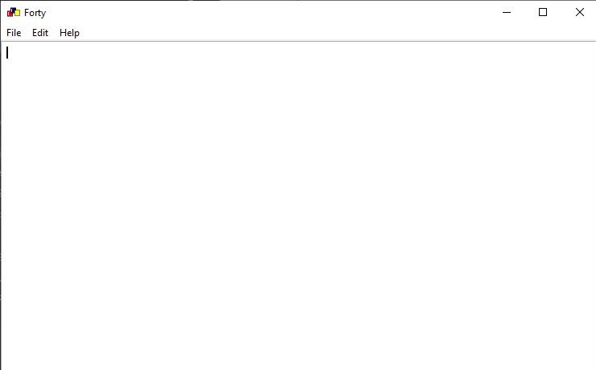

## Forty

This is a proof of concept that GUI programming can be done in C++. It is a super simple text editor that can handle pretty much any type of document.

## Features
- Open Files
- Save Files
- Print Document (Still working on it)

Thats all of it, told you it was really simple `¯\_(ツ)_/¯`.

## What it looks like


## Dependency
- wxWidgets >= 3.0
- CMake >= 3.1

## Getting Started
Before cloning the repository, make sure you have satisfied the dependecy requirements. 
Here are some source to help with the dependency:
- Installing [wxWidgets](https://wiki.wxwidgets.org/Install)
- Installing [CMake](https://cmake.org/install/)

You can now clone the repository using git:
`git clone https://github.com/t1jani/forty.git`


#### Compile on Windows
To compile this project on windows create a build directory in the projects root directory, this way if anything goes wrong and you would like to restart all you have to do is delete the build directory and start again. 
Run the following command to generate a visual studio solution files:
```bash
cmake -G "Visual Studio 16 2019" ..
## Set forty and startup project inside visual studio
```

#### Compile on MacOS and Linux
I prefer to use the CLion IDE to compile on macos, but if you dont have access to that you can also generate makefiles with cmake (isn't that great?):
```bash
cmake -G "Unix Makefiles" ..   # Generates the make files
make    # Compile and Link using make

# Inside the build directory 
cd src 
./forty
```

## Compatibility
This piece of software works on Windows, Linux and MacOS X.

## Todo 
Some of the remaining things to do can be found [here](todo.md)
